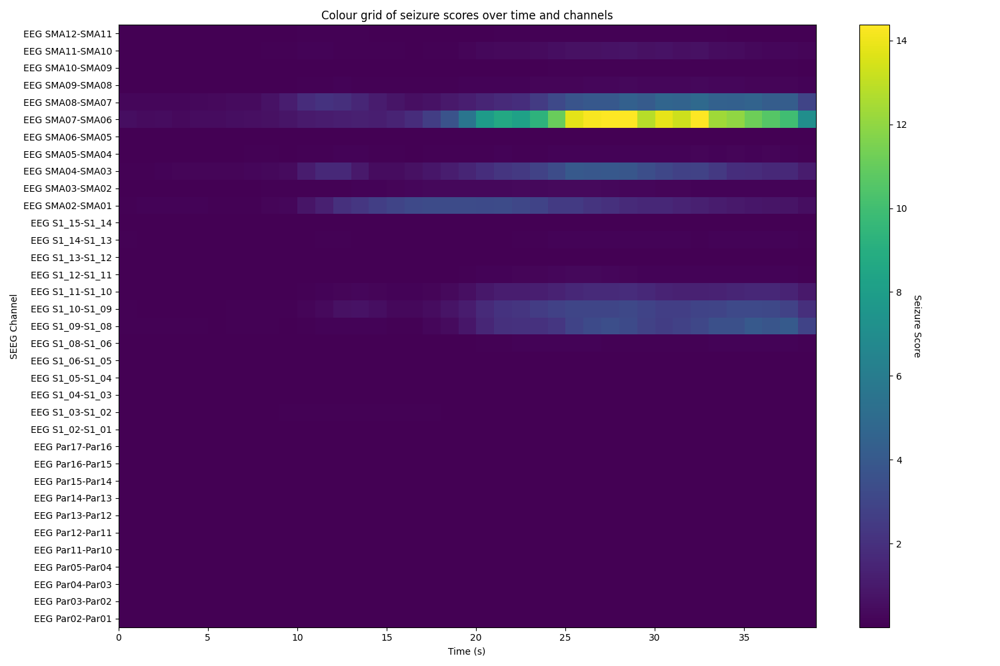

# Unsupervised Seizure Detection using a Convolutional Autoencoder

## Objective
This project trains a convolutional autoencoder for anomaly detection using publicly available interictal iEEG data. The end goal is to develop a channel-by-channel seizure detector, allowing us to analyse the onset and spread of a seizure, like so:


## Requirements
1. If you want to train from scratch, download the dataset [here](https://openneuro.org/datasets/ds003876/versions/1.0.2). See below for a reference.
2. Install the requirements like so:
    ```
    pip install -r requirements.txt
    ```
## Usage
Everything you should need is in [a Jupyter notebook](/seizure_detection.ipynb). If you want to train a model, you'll need to change the path for the data. Otherwise, you can set the _training_ variable to False, and use the existing weights.

## Reference
Gunnarsdottir, Kristin and Li, Adam and Smith, Rachel and Kang, Joon and Korzeniewska, Anna and Crone, Nathan and Rouse, Adam and Cheng, Jennifer and Kinsman, Michael and Landazuri, Patrick and Uysal, Utku and Ulloa, Carol and Cameron, Nathaniel and Cajigas, Iahn and Jagid, Jonathan and Kanner, Andres and Elarjani, Turki and Bicchi, Manuel and Inati, Sara and Zaghloul, Kareem and Boerwinkle, Varina and Wyckoff, Sarah and Barot, Niravkumar and Gonzalez-Martinez, Jorge and Sarma, Sridevi (2023). Epilepsy-iEEG-Interictal-Multicenter-Dataset. OpenNeuro. [Dataset] doi: doi:10.18112/openneuro.ds003876.v1.0.2